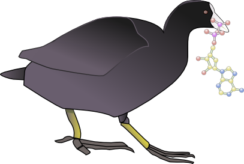
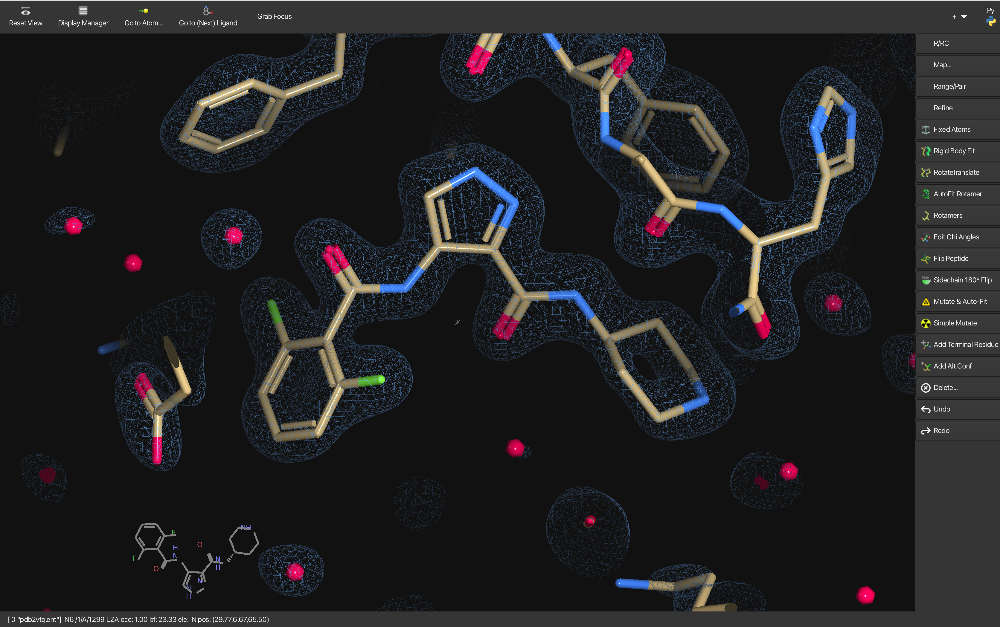

<head>
    <link href="https://fonts.googleapis.com/css2?family=DM+Sans:wght@300;400;700&display=swap" rel="stylesheet">
    <link rel="stylesheet" href="style.css">
    <link rel="icon" type="image/png" href="web/coot-favicon.png"/>
</head>

<nav id="navigation">
  <ul>
    <li><a href="http://www2.mrc-lmb.cam.ac.uk/Personal/pemsley/coot/binaries/">Download Binaries</a></li>
    <li><a href="http://www2.mrc-lmb.cam.ac.uk/Personal/pemsley/coot/source/">Source Code</a></li>
    <li><a href="web/build-install-coot-from-scratch.html">Build Coot from Scratch</a></li>
    <li><a href="web/docs/coot-docu.html">Coot Documentation</a></li>
    <li><a href="https://www2.mrc-lmb.cam.ac.uk/personal/pemsley/coot/docs/api/html/">Libcootapi</a></li>
    <li><a href="https://pemsley.github.io/coot/blog">Coot Blog</a></li>
    <li><a href="http://strucbio.biologie.uni-konstanz.de/ccp4wiki/index.php/COOT">Wiki</a></li>
    <li><a href="docs/coot-faq.html">FAQ</a></li>
    <li><a href="web/tutorial/tutorial.html">Tutorials</a></li>
    <li><a href="https://moorhen-coot.github.io/wiki/">Moorhen Tutorials and Blog</a></li>
    <li><a href="web/mailing-list.html">Mailing List</a></li>
    <li><a href="http://www2.mrc-lmb.cam.ac.uk/Personal/pemsley/coot/data/">Test Data</a></li>
    <li><a href="http://www2.mrc-lmb.cam.ac.uk/Personal/pemsley/coot/files/">Auxiliary Files</a></li>
    <li><a href="web/screenshots/screenshots.html">Screenshots</a></li>
  </ul>
</nav>

::: {#content}
# *Coot*

### Is this the \"Official Home of *Coot*\"?

Yes - welcome!

### What does *Coot* stand for?

Crystallographic Object-Oriented Toolkit

### What does it do?

*Coot* is for macromolecular model building, model completion and validation, particularly suitable for protein modelling using X-ray data. *Coot* displays maps and models and allows model manipulations such as:

* idealization
- real space refinement
- manual rotation/translation
- rigid-body fitting
- ligand search
- solvation
- mutations
- rotamers
- Ramachandran plots
- skeletonization
- non-crystallographic symmetry

These days it is useful for cryo-EM data and models, too.

### What\'s the latest stable release?

Gtk+2: 0.9.8.95

GTK4: 1.1.10

### Where are the release binaries?

Binaries for Coot 1.1.x are not available for as many platforms as I would like at the moment :

<https://www2.mrc-lmb.cam.ac.uk/personal/pemsley/coot/binaries/release/>

Go the the bottom of the list for the newest release.
It is (or will be) part of the operating system for Debian and Ubuntu - so you can use apt to install it.

And thanks to Yoshitaka Moriwaki you can install it from homebrew on a Mac.

For Coot 1.1.x installation, visit: <https://github.com/pemsley/coot>

### What\'s it like?

*Coot* has some features that resemble those of Frodo, O, Quanta, and XtalView's XFit. Or perhaps PyMOL or ChimeraX. It is much better at graphics than it used to be.

To be clear, it is completely independent of any of the above software. *Coot* can now handle many aspects of structure representation, such as ribbons or sophisticated coloring schemes.

*Coot* is under active development. New features are being added regularly.

**Moorhen** is the sister project to *Coot*: \"Coot on the Web\" you
might call it - although it has grown in scope since the first year and
is now capable of making some attractive-looking publication quality
images also. If that is of interest, you can try it out at
[moorhen.org](https://moorhen.org).

More info about Moorhen: <https://github.com/moorhen-coot/Moorhen>

### Is there a *Coot* FAQ?

[Yes](docs/coot-faq.html).

### Is there a *Coot* Mailing list?

There is a *Coot* mailing list now hosted by the jiscmail service :

[http://www.jiscmail.ac.uk/lists/coot.html](http://www.jiscmail.ac.uk/lists/coot.html){alt="link to coot mailing list homepage"}

### Is there *Coot* documentation?

[Yes\...](web/docs/coot-docu.html).

Some presentations:

- The 2025 CCP4 Study Weekend *Coot* and *Moorhen* presentation can be found [here](web/Coot_Moorhen_CPP4SW_2025.pdf).
- The 2012 ACA *Coot* Basics can be found [here](web/aca-2012-coot-the-basics.pdf).
- The 2012 ACA *Coot* Extras can be found [here](web/aca-2012-low-resolution-scripting-ligands-and-bumps.pdf).
- The 2010 CCP4 Study weekend presentation can be found [here](web/coot-nottingham-jan-2010.pdf).

### How do I cite *Coot*?

Please see [the FAQ](docs/coot-faq.html#Citing). Get [the
paper](http://journals.iucr.org/d/issues/2010/04/00/ba5144/ba5144.pdf).

I like to spell *Coot* with a capital \"C\" and lower-case \"oot\", with
italics. I am not dogmatic about it.

### OK, how does it look?

Like this:

### Hmm\... very pretty. Any other pics?

Try [here](web/screenshots/screenshots.html).

### Does it work with a white background?

Yes. You can make nice-looking density figures now. See for example the
figures in the \"Neutron crystallographic refinement with REFMAC5 from the
CCP4 suite\" - Catapano *et al.* (2023).

### What formats?

PDB, mmCIF, MTZ files, .phs and others.

### It makes maps from MTZ and .phs files?

Yes.

### Can it read conventional CCP4 maps?

Yes.

### Can it read any other kind of map?

Yes, it can read CNS maps.

### Is it scriptable?

Yep, hundreds of functions are made available to the user via
[SWIG](http://www.swig.org) and can be scripted in either Python or
scheme. 

The modern Pythonic interface to libcootapi is called **chapi**.
Chapi documentation can be found [here](https://www.mrc-lmb.cam.ac.uk/lucrezia/libcootapi-documentation/).

### Where do I get it?

See the sidebar.

Which binary should I use? See the [FAQ](docs/coot-faq.html).

### How do I install it?

Read the README in the source tar file.

### What libraries do I need?

-   fftw
-   mmdb
-   ccp4c
-   clipper
-   guile or Python
-   glib
-   GTK+-2 and gdk
-   pthread
-   gtkglext
-   gnome-canvas
-   zlib
-   GSL
-   GL
-   GLU
-   glut

### Errg. Sounds complicated.

Yes, it is a bit. [Binary distributions](binaries/pre-releases) for a
selection of systems are built every night.

There is an [\"autobuilder\" build
script](https://raw.githubusercontent.com/pemsley/coot/main/build-it-3-3)
which we use to make build the binaries.

I should add that *Coot* depends on many other projects, some general
(GTK+, the GNU Scientific Library, python, guile, GL graphics libraries
and toolkits) and others more specific to structural biology (mmdb,
clipper) which are fundamental to the design and implementation of the
program.

### What is the licence?

Mostly GPLv3, some GLPv2+, some LGPLv3.

### So I can just download it and use it, no questions asked?

Yep. Be my guest.

### Even if I\'m part of a Big Pharma?

Yes.

### On which platforms does it run?

Certainly on Ubuntu, Fedora, RedHat Enterprise Linux, Microsoft Windows, MacOS X.

You can get WinCoot [here](http://bernhardcl.github.io/coot/wincoot-download.html).

Getting the Coot binaries to run on RHEL, or SuSe might take a bit more effort.
Please see the [Coot FAQ](docs/coot-faq.html).

### Not to be confused with:

[Alwyn Jones\' O](http://xray.bmc.uu.se/~alwyn/index.html),
[Quanta](http://www.accelrys.com/products/quanta/),
[XtalView](http://www.sdsc.edu/CCMS/Packages/XTALVIEW/xtalview.html),
[CCP4mg](http://www.ysbl.york.ac.uk/~ccp4mg/).

### What is the Coot holding in its beak, by the way?

It\'s biting off the gamma phosphate of an ATP.

### And that\'s supposed to be an allusion to a biochemical process, is it?

Err.. yes.

### Most likely to say:

\"Now how does that Refmac button work again..?\"

### Least likely to say:

\"On reflection, it\'d have been much better to implement using
Tcl/Tk.\"

--------------------------------
**Author:** Paul Emsley 
**Date:** February 22, 2025
:::

