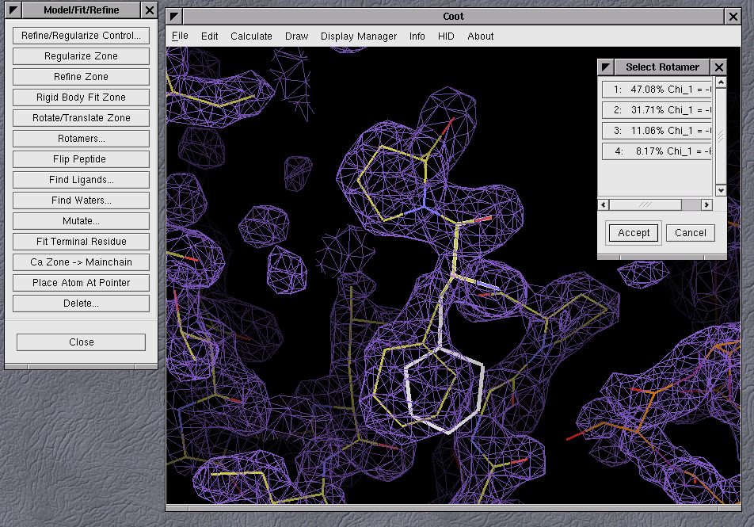

<head>
    <link href="https://fonts.googleapis.com/css2?family=Roboto:wght@300;400;700&display=swap" rel="stylesheet">
    <link rel="stylesheet" href="style-gallery.css">
</head>

# Coot Screenshots

### Coot 1

### Apoferritin screenshots

### Coot 0.0 to 0.9.x

 

